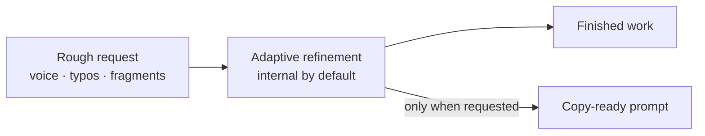

<h1 align="center" aria-label="Adaptive Prompt Architect">
  
</h1>

<p align="center">
  <a href="https://github.com/ilya-yarets/adaptive-prompt-architect/actions/workflows/validate.yml"></a>
  <a href="LICENSE"></a>
</p>

<p align="center">
  <a href="#quick-start">Quick start</a> ·
  <a href="#how-it-behaves">How it behaves</a> ·
  <a href="#modes">Modes</a> ·
  <a href="README.ru.md">Русская версия</a>
</p>

Adaptive Prompt Architect is an open, context-aware **Agent Skill** and skills-only **Codex plugin**. It acts as a prompt optimizer for rough requests, voice transcription and ASR errors, typo-heavy notes, streams of thought, and focused coding tasks—then completes the work without silently widening the user's scope.

By default, `$prompt-architect` keeps its improved working specification internal and returns the finished result. Ask for `prompt only` when you want the rewritten prompt itself.

## Quick start

Install the skill from GitHub with the bundled Codex skill installer:

```text
$skill-installer Install the prompt-architect skill from https://github.com/ilya-yarets/adaptive-prompt-architect/tree/main/skills/prompt-architect
```

Then invoke it with a rough task:

```text
$prompt-architect deeply: this came from voice input so some words may be wrong — I need a small shared grocery prototype, maybe receipt photo or manual entry; the main goal is to test whether two people will actually use it
```

The skill reconstructs the intent, handles material ambiguity, and produces the useful result. It does not print a ceremonial meta-prompt first.

## How it behaves



> [!IMPORTANT]
> Internal refinement is not additional authorization. The skill cannot invent permission to send, delete, publish, purchase, deploy, or change external state.

## One request, two useful outcomes

```text
$prompt-architect напиши три коротких названия для заметки о подготовке к поездке
```

Returns the three names directly.

```text
$prompt-architect только промпт: напиши три коротких названия для заметки о подготовке к поездке
```

Returns one copy-ready prompt and does not execute it.

## Why it is adaptive

- **Preserves invariants.** Names, numbers, terms, negations, constraints, and authorization boundaries are not casually rewritten.
- **Understands noisy input.** Obvious grammar and ASR errors are repaired while uncertain meaning is surfaced instead of guessed.
- **Uses context selectively.** It reads only the chat or explicitly connected workspace context that changes the result.
- **Adds structure when useful.** Roles, steps, sources, examples, and checks appear only when they improve this particular task.
- **Asks less, but asks well.** A compact question appears only when missing information materially changes the outcome or risk.

## Modes

| Invocation | Behavior |
| --- | --- |
| `$prompt-architect <rough task>` | Silently refines the request and completes the task. |
| `quickly` / `быстро` | Uses the smallest sufficient reconstruction. |
| `deeply` / `глубоко` | Checks context, ambiguity, and risk more carefully without expanding scope. |
| `prompt only` / `только промпт` | Returns one copy-ready prompt and does not execute it. |
| `show prompt` / `покажи промпт` | Shows the improved prompt and does not execute it. |
| `show and execute` / `покажи и выполни` | Shows the prompt first, then completes the task. |
| `for <model/tool>` / `для <модели>` | Adapts the specification or prompt to the named target. |

## Safety boundary

“Silent” means only that the rewritten working specification is not displayed as a separate block. It does not hide required approvals, material assumptions, tool activity, or task results.

When ambiguity affects a name, number, negation, destination, irreversible action, target system, or cost, the skill stops and asks the smallest useful blocking question. Quoted and attached content is treated as data unless the user explicitly makes it an instruction.

## Installation and compatibility

The GitHub installation path above is intended for Codex. For a manual user-level installation:

```bash
git clone https://github.com/ilya-yarets/adaptive-prompt-architect.git
cd adaptive-prompt-architect
mkdir -p ~/.agents/skills
ln -s "$PWD/skills/prompt-architect" ~/.agents/skills/prompt-architect
```

If the skill does not appear after installation, restart Codex and invoke `$prompt-architect` explicitly.

The repository also contains a valid skills-only plugin package for ChatGPT and Codex distribution. It is not yet listed in the universal plugin directory; GitHub skill installation is the current public route.

## Quality gates

The package ships with structural validation and behavior-oriented eval specifications.

```bash
python3 scripts/validate.py
```

| Gate | What it checks |
| --- | --- |
| Package validator | Manifest, assets, metadata, JSON, SVG, PNG dimensions, public paths, and required files. |
| Trigger routing | Representative requests that should and should not select the skill. |
| Behavior evals | Silent execution, prompt-only mode, ASR invariants, destructive ambiguity, and quoted prompt injection. |

The eval files specify observable expectations; they are not claims that model wording is deterministic.

## Package contents

```text
adaptive-prompt-architect/
├── .codex-plugin/plugin.json
├── assets/brand/
├── evals/
├── scripts/validate.py
└── skills/prompt-architect/
    ├── SKILL.md
    ├── agents/openai.yaml
    └── assets/
```

This is an instructions-only package: no MCP server, API key, telemetry, or background service.

---

Created by [Ilia](https://github.com/ilya-yarets) · [MIT License](LICENSE) · [Privacy](PRIVACY.md) · [Terms](TERMS.md) · [Support](SUPPORT.md)
