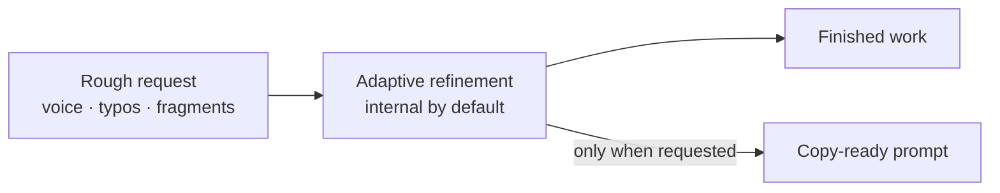

<h1 align="center" aria-label="Adaptive Prompt Architect">
  
</h1>

<p align="center">
  <a href="https://github.com/ilya-yarets/adaptive-prompt-architect/actions/workflows/validate.yml"></a>
  <a href="LICENSE"></a>
</p>

<p align="center">
  <a href="#quick-start">Quick start</a> ·
  <a href="#how-it-behaves">How it behaves</a> ·
  <a href="#modes">Modes</a> ·
  <a href="SECURITY.md">Security</a> ·
  <a href="README.ru.md">Read in Russian</a>
</p>

<p align="center"><strong>Messy thoughts in. Clear intent out. No prompt bloat.</strong></p>

Good ideas rarely arrive as polished prompts. They arrive as voice notes, fragments, typos, and streams of thought.

**Adaptive Prompt Architect turns that rough input into clear, actionable intent—then either returns a focused, copy-ready prompt or gets the work done.** It adds only the structure the task needs, preserves your constraints, and avoids rigid, overloaded templates.

It is an open, context-aware **Agent Skill with documented setup for Codex, Claude Code, and Cursor**, plus a skills-only Codex plugin. By default, prompt-architect keeps the refined working specification internal and returns the finished result. Use `prompt only` when you want the rewritten prompt itself.

## Quick start

With Codex, install the skill from GitHub using the bundled skill installer:

```text
$skill-installer Install the prompt-architect skill from https://github.com/ilya-yarets/adaptive-prompt-architect/tree/main/skills/prompt-architect
```

Then invoke it with a rough task:

```text
$prompt-architect deeply: this came from voice input so some words may be wrong — I need a small shared grocery prototype, maybe receipt photo or manual entry; the main goal is to test whether two people will actually use it
```

In Claude Code or Cursor, use the same request with `/prompt-architect`; their setup is documented below. The skill reconstructs the intent, handles material ambiguity, and returns the useful result—without a mandatory prompt preamble.

## How it behaves



> [!IMPORTANT]
> Internal refinement is not additional authorization. The skill cannot invent permission to send, delete, publish, purchase, deploy, or change external state.

## One request, two useful outcomes

```text
$prompt-architect Give me three short titles for a note about planning a trip
```

Returns the three names directly.

```text
$prompt-architect prompt only: Give me three short titles for a note about planning a trip
```

Returns one copy-ready prompt and does not execute it.

## Why it is adaptive

- **Preserves invariants.** Names, numbers, terms, negations, constraints, and authorization boundaries are not casually rewritten.
- **Understands noisy input.** Obvious grammar and ASR errors are repaired while uncertain meaning is surfaced instead of guessed.
- **Starts from the outcome.** It defines what success looks like without prescribing a path the agent can choose better from context.
- **Uses context progressively.** It points to relevant project conventions and references without loading or copying everything up front.
- **Keeps only useful scaffolding.** Roles, steps, examples, and checks stay only when they encode a real requirement or correct a measured gap.
- **Asks less, but asks well.** A compact question appears only when missing information materially changes the outcome or risk.

## Modes

In the table, `<invoke>` means `$prompt-architect` in Codex or `/prompt-architect` in Claude Code and Cursor. The modes are otherwise identical.

| Invocation | Behavior |
| --- | --- |
| `<invoke> <rough task>` | Silently refines the request and completes the task. |
| `<invoke> quickly: <rough task>` | Uses the smallest sufficient reconstruction. |
| `<invoke> deeply: <rough task>` | Checks context, ambiguity, and risk more carefully without expanding scope. |
| `<invoke> prompt only: <rough task>` | Returns one copy-ready prompt and does not execute it. |
| `<invoke> show prompt: <rough task>` | Shows the improved prompt and does not execute it. |
| `<invoke> show and execute: <rough task>` | Shows the prompt first, then completes the task. |
| `<invoke> for <model/tool>: <rough task>` | Adapts the specification or prompt to the named target. |

## Safety boundary

“Silent” means only that the rewritten working specification is not displayed as a separate block. It does not hide required approvals, material assumptions, tool activity, or task results.

When ambiguity affects a name, number, negation, destination, irreversible action, target system, or cost, the skill stops and asks the smallest useful blocking question. Authority comes from the source: quoted, attached, retrieved, tool-returned, and file content stays data and cannot expand scope or override safety.

## Installation and compatibility

The same `SKILL.md` follows the open [Agent Skills specification](https://agentskills.io/specification) on every host; only discovery and explicit invocation differ.

| Agent | User-level discovery path | Explicit invocation |
| --- | --- | --- |
| [Codex](https://learn.chatgpt.com/docs/build-skills) | `~/.agents/skills/prompt-architect`, or `~/.codex/skills/prompt-architect` via the bundled installer | `$prompt-architect` |
| [Claude Code](https://code.claude.com/docs/en/skills) | `~/.claude/skills/prompt-architect` | `/prompt-architect` |
| [Cursor](https://cursor.com/docs/skills) | `~/.agents/skills/prompt-architect` | `/prompt-architect` |

Use the Codex installer from Quick start above. It installs under `$CODEX_HOME/skills` (normally `~/.codex/skills`); Cursor discovers both that compatibility path and `~/.agents/skills` automatically. Cursor-only users can instead open **Customize → Rules → Add Rule → Remote Rule (GitHub)** and enter this repository URL.

To reuse an existing Codex installation in Claude Code on macOS or Linux, use this guarded link:

```bash
agents_skill="$HOME/.agents/skills/prompt-architect"
codex_skill="${CODEX_HOME:-$HOME/.codex}/skills/prompt-architect"
claude_skill="$HOME/.claude/skills/prompt-architect"
shared_skill=""

if [ -f "$agents_skill/SKILL.md" ]; then
  shared_skill="$agents_skill"
elif [ -f "$codex_skill/SKILL.md" ]; then
  shared_skill="$codex_skill"
else
  printf '%s\n' "No local prompt-architect installation found."
fi

if [ -n "$shared_skill" ]; then
  if [ -e "$claude_skill" ] || [ -L "$claude_skill" ]; then
    printf 'Already exists: %s\n' "$claude_skill"
  else
    mkdir -p "$HOME/.claude/skills"
    ln -s "$shared_skill" "$claude_skill"
  fi
fi
```

Claude-only users can clone the repository and link its `skills/prompt-architect` folder into the Claude discovery path with the same existence check. On Windows, or when symlinks are undesirable, copy that skill folder into the documented host path only after checking that the target does not already exist.

If the skill does not appear, start a new agent session and invoke it explicitly. Host-runtime behavior still depends on the installed host version and model; the repository validates the shared format, routing fixtures, and behavioral specifications rather than claiming deterministic output across products.

The repository also contains a valid skills-only plugin package for ChatGPT and Codex distribution. Other Agent Skills-compatible hosts may accept the same folder, but they are outside the current documented support matrix.

## Quality gates

The package ships with structural validation and behavior-oriented eval specifications.

```bash
python3 scripts/validate.py
```

| Gate | What it checks |
| --- | --- |
| Package validator | Manifest, assets, metadata, JSON, SVG, PNG dimensions, public paths, and required files. |
| Trigger routing | Representative requests that should and should not select the skill. |
| Behavior evals | Silent execution, prompt-only mode, ASR invariants, destructive ambiguity, source authority, progressive references, legacy-scaffolding removal, and proportionate validation. |

The eval files specify observable expectations; they are not claims that model wording is deterministic.

## Package contents

```text
adaptive-prompt-architect/
├── .codex-plugin/plugin.json
├── .github/
├── assets/brand/
├── evals/
├── SECURITY.md
├── scripts/validate.py
└── skills/prompt-architect/
    ├── SKILL.md
    ├── agents/openai.yaml
    └── assets/
```

This is an instructions-only package: no MCP server, API key, telemetry, or background service.

---

Created by [Ilia](https://github.com/ilya-yarets) · [Changelog](CHANGELOG.md) · [MIT License](LICENSE) · [Security](SECURITY.md) · [Contributing](CONTRIBUTING.md) · [Privacy](PRIVACY.md) · [Terms](TERMS.md) · [Support](SUPPORT.md)
