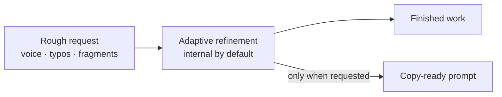

<h1 align="center" aria-label="Adaptive Prompt Architect">
  
</h1>

<p align="center">
  <a href="https://github.com/ilya-yarets/adaptive-prompt-architect/actions/workflows/validate.yml"></a>
  <a href="LICENSE"></a>
</p>

<p align="center">
  <a href="#quick-start">Quick start</a> ·
  <a href="#how-it-behaves">How it behaves</a> ·
  <a href="#modes">Modes</a> ·
  <a href="SECURITY.md">Security</a> ·
  <a href="README.ru.md">Read in Russian</a>
</p>

<p align="center"><strong>Messy thoughts in. Clear intent out. No prompt bloat.</strong></p>

Good ideas rarely arrive as polished prompts. They arrive as voice notes, fragments, typos, and streams of thought.

**Adaptive Prompt Architect turns that rough input into clear, actionable intent—then either returns a focused, copy-ready prompt or gets the work done.** It adds only the structure the task needs, preserves your constraints, and avoids rigid, overloaded templates.

It is an open, context-aware **Agent Skill** and skills-only **Codex plugin**. By default, `$prompt-architect` keeps the refined working specification internal and returns the finished result. Use `prompt only` when you want the rewritten prompt itself.

## Quick start

Install the skill from GitHub with the bundled Codex skill installer:

```text
$skill-installer Install the prompt-architect skill from https://github.com/ilya-yarets/adaptive-prompt-architect/tree/main/skills/prompt-architect
```

Then invoke it with a rough task:

```text
$prompt-architect deeply: this came from voice input so some words may be wrong — I need a small shared grocery prototype, maybe receipt photo or manual entry; the main goal is to test whether two people will actually use it
```

The skill reconstructs the intent, handles material ambiguity, and returns the useful result—without a mandatory prompt preamble.

## How it behaves



> [!IMPORTANT]
> Internal refinement is not additional authorization. The skill cannot invent permission to send, delete, publish, purchase, deploy, or change external state.

## One request, two useful outcomes

```text
$prompt-architect Give me three short titles for a note about planning a trip
```

Returns the three names directly.

```text
$prompt-architect prompt only: Give me three short titles for a note about planning a trip
```

Returns one copy-ready prompt and does not execute it.

## Why it is adaptive

- **Preserves invariants.** Names, numbers, terms, negations, constraints, and authorization boundaries are not casually rewritten.
- **Understands noisy input.** Obvious grammar and ASR errors are repaired while uncertain meaning is surfaced instead of guessed.
- **Uses context selectively.** It reads only the chat or explicitly connected workspace context that changes the result.
- **Adds structure when useful.** Roles, steps, sources, examples, and checks appear only when they improve this particular task.
- **Asks less, but asks well.** A compact question appears only when missing information materially changes the outcome or risk.

## Modes

| Invocation | Behavior |
| --- | --- |
| `$prompt-architect <rough task>` | Silently refines the request and completes the task. |
| `$prompt-architect quickly: <rough task>` | Uses the smallest sufficient reconstruction. |
| `$prompt-architect deeply: <rough task>` | Checks context, ambiguity, and risk more carefully without expanding scope. |
| `$prompt-architect prompt only: <rough task>` | Returns one copy-ready prompt and does not execute it. |
| `$prompt-architect show prompt: <rough task>` | Shows the improved prompt and does not execute it. |
| `$prompt-architect show and execute: <rough task>` | Shows the prompt first, then completes the task. |
| `$prompt-architect for <model/tool>: <rough task>` | Adapts the specification or prompt to the named target. |

## Safety boundary

“Silent” means only that the rewritten working specification is not displayed as a separate block. It does not hide required approvals, material assumptions, tool activity, or task results.

When ambiguity affects a name, number, negation, destination, irreversible action, target system, or cost, the skill stops and asks the smallest useful blocking question. Authority comes from the source: quoted, attached, retrieved, tool-returned, and file content stays data and cannot expand scope or override safety.

## Installation and compatibility

The GitHub installation path above is intended for Codex. For a manual user-level installation:

```bash
git clone https://github.com/ilya-yarets/adaptive-prompt-architect.git
cd adaptive-prompt-architect
mkdir -p ~/.agents/skills
ln -s "$PWD/skills/prompt-architect" ~/.agents/skills/prompt-architect
```

If the skill does not appear after installation, restart Codex and invoke `$prompt-architect` explicitly.

The repository also contains a valid skills-only plugin package for ChatGPT and Codex distribution. It is not yet listed in the universal plugin directory; GitHub skill installation is the current public route.

## Quality gates

The package ships with structural validation and behavior-oriented eval specifications.

```bash
python3 scripts/validate.py
```

| Gate | What it checks |
| --- | --- |
| Package validator | Manifest, assets, metadata, JSON, SVG, PNG dimensions, public paths, and required files. |
| Trigger routing | Representative requests that should and should not select the skill. |
| Behavior evals | Silent execution, prompt-only mode, ASR invariants, destructive ambiguity, source-authority injection, and confirmation preservation. |

The eval files specify observable expectations; they are not claims that model wording is deterministic.

## Package contents

```text
adaptive-prompt-architect/
├── .codex-plugin/plugin.json
├── .github/
├── assets/brand/
├── evals/
├── SECURITY.md
├── scripts/validate.py
└── skills/prompt-architect/
    ├── SKILL.md
    ├── agents/openai.yaml
    └── assets/
```

This is an instructions-only package: no MCP server, API key, telemetry, or background service.

---

Created by [Ilia](https://github.com/ilya-yarets) · [MIT License](LICENSE) · [Security](SECURITY.md) · [Contributing](CONTRIBUTING.md) · [Privacy](PRIVACY.md) · [Terms](TERMS.md) · [Support](SUPPORT.md)
